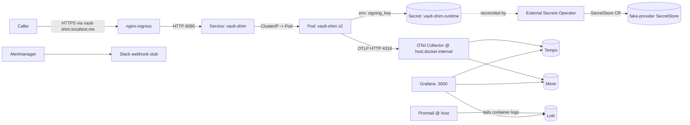

# RUNBOOK.md — vault-shim 2 AM on-call

This runbook ships complete (unlike v1). Your `JUDGEMENT.md` Section 2 critique of this file is welcome — does it work for a junior on-call at 2 AM? Reviewers will read your critique.

---

## Topology



- **Public surface:** localhost via nginx-ingress on Docker Desktop's host mapping (kind kindnetd → 127.0.0.1).
- **Cluster surface:** PSS Restricted, default-deny NetworkPolicy, namespace-scoped RBAC.
- **Observability:** LGTM stack runs in docker-compose on the host (NOT in cluster). vault-shim sends OTLP to `host.docker.internal:4318`.

---

## How to find what's broken

### 1. Open the RED dashboard

`http://localhost:3000` → "vault-shim — RED" dashboard. You're looking for: request rate dropping to 0, 5xx ratio spiking, p95 latency drifting up.

### 2. Drill into the time window

Click on a spiking time-range on the RED dashboard → "Explore" → switch to Loki datasource → `{app="vault-shim"} | json | __error__=""` to get structured logs in that window. Filter by `status>=500` for errors.

### 3. Trace one failing request

From a Loki log line, grab the `trace_id` field → switch to Tempo → paste the trace ID → see the full span tree (HTTP handler → auth middleware → in-memory store call).

### 4. Check NetworkPolicy denies

If symptoms suggest blocked traffic (timeouts, no metrics flowing): `kubectl -n vault-shim get networkpolicy -o yaml`. The default-deny baseline + 3 allow rules should cover ingress, kube-dns, ESO. **If you see no metrics in Grafana, the most likely cause is missing egress for the OTel destination — check the allow rules.**

---

## Common ops

### Rotate the bearer-token-signing-key

```bash
# 1. Update the fake-provider SecretStore (production: rotate in AWS Secrets Manager).
kubectl -n vault-shim edit secretstore vault-shim-store
#    Change the `value:` field for `/vault-shim/runtime/signing-key`.

# 2. Trigger an immediate refresh (ESO normally waits for refreshInterval).
kubectl -n vault-shim annotate externalsecret vault-shim-runtime \
  force-sync=$(date +%s) --overwrite

# 3. Restart the Deployment to pick up the new env var.
kubectl -n vault-shim rollout restart deployment/vault-shim
kubectl -n vault-shim rollout status deployment/vault-shim --timeout=2m
```

### Roll back to the previous image digest

```bash
# 1. Get the previous image digest from the Deployment's rollout history.
kubectl -n vault-shim rollout history deployment/vault-shim

# 2. Roll back.
kubectl -n vault-shim rollout undo deployment/vault-shim

# 3. Verify.
kubectl -n vault-shim get pod -l app.kubernetes.io/name=vault-shim \
  -o jsonpath='{.items[*].spec.containers[*].image}'
```

### Add a new alert

Edit `observability/alerts/alerts.yaml`, add a rule with a `runbook_url` annotation pointing at the new section in this file. `make observability-up` re-loads on restart of the alertmanager container.

### Scale HPA max

Edit `deploy/pdb-hpa.yaml` `maxReplicas`, `kubectl apply -k deploy/`.

---

## Escalation matrix

| Severity | Symptom | Page | Within |
| --- | --- | --- | --- |
| P0 | vault-shim 5xx ratio > 50%; ingress is up | DevSecOps on-call | 5 min |
| P0 | Audit log gap > 1h (no logs in Loki) | DevSecOps on-call + Compliance | 15 min |
| P1 | 5xx ratio > 5% for 10m | DevSecOps on-call | 30 min |
| P1 | Cosign verify failing on deploys | DevSecOps on-call | 1 hr |
| P2 | Dashboard / alert noise | DevSecOps on-call (business hours) | next business day |

---

## Repo-handoff notes

If you're the next engineer (or agent) picking up this repo:

1. **Read `SECURITY.md` first.** Every control row points at the file that enforces it; that's the fastest tour of the codebase.
2. **Inner-loop:** `docker compose up` for vault-shim alone is the fastest iteration. Full-stack `make up` is for end-to-end work only.
3. **The LGTM stack is intentionally on the host, not in cluster.** Keeps kind boot time under 60s and means inner-loop `docker compose up` can also export traces to the same collector.
4. **`host.docker.internal` resolution from kind pods is Docker Desktop magic.** On Linux Docker (no Desktop), it doesn't resolve by default — see `observability/README.md` "cross-boundary path" for workarounds.
5. **Don't add a `kind: Secret` manifest to deploy/.** The semgrep `deploy-no-plain-k8s-secret` rule will fail CI, and there's a good reason: External Secrets is the only path.
6. **Pinned GitHub Action SHAs are non-negotiable.** Dependabot auto-bumps them; review the bump PR like any other supply-chain change.

---

## Scenario walkthroughs

These are the scenarios the alerts link to. Detail lives in `INCIDENT_TABLETOP.md`.

- `#scenario-5xx-spike` → covered in `INCIDENT_TABLETOP.md` scenario (b) [stub at this tier]
- `#scenario-auth-spike` → covered in `INCIDENT_TABLETOP.md` scenario (c) [stub at this tier]
- `#scenario-no-traces` → see `observability/README.md` "cross-boundary path" + `deploy/networkpolicy.yaml`
- `#scenario-secret-in-logs` → covered in `INCIDENT_TABLETOP.md` scenario (a) [you flesh in detail]
